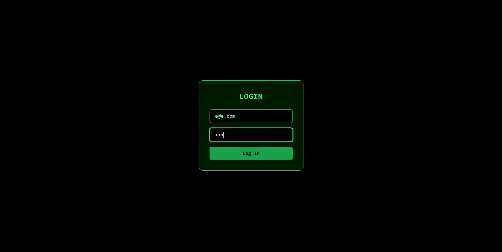
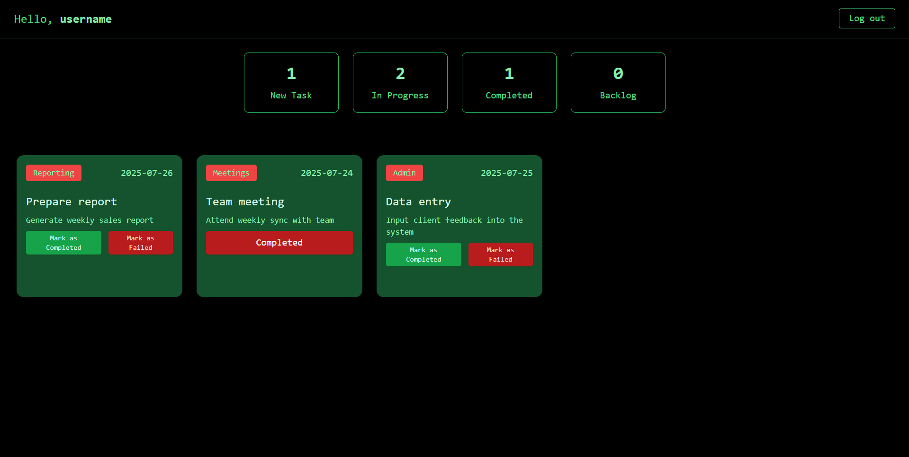
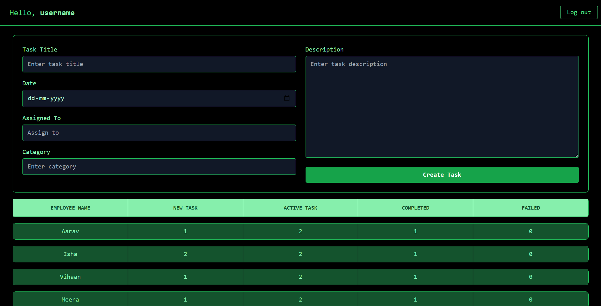

# GreenBoard – Employee Task Manager

A web-based application with **Admin** and **Employee** dashboards for managing tasks.  
Built with a clean green-themed UI, featuring login authentication and data persistence using **localStorage**.

---

## 🚀 Features

### 🔑 Login System
- Simple login form for Admin and Employees.
- Credentials stored and verified from `localStorage`.

### 🛠 Admin Dashboard
- Create and assign tasks to employees.
- Add task details: **Title**, **Date**, **Assigned To**, **Category**, and **Description**.
- View overall employee performance in a table.
- Task statistics: **New**, **In Progress**, **Completed**, and **Backlog**.

### 👨‍💼 Employee Dashboard
- View assigned tasks categorized by status.
- Mark tasks as **Completed** or **Failed**.
- Real-time updates reflected in task counters.

### 💾 Data Persistence
- All data (tasks, users, statuses) stored in browser `localStorage` — no backend required.

---

## 📸 Screenshots

### Login


### Employee Dashboard


### Admin Dashboard


---

## 🛠 Tech Stack
- **Frontend:** HTML, CSS, JavaScript (React.js)
- **Styling:** Tailwind CSS
- **Storage:** LocalStorage API
- **Build Tool:** Vite

---

## 📦 Installation & Usage

1. **Clone the repository**
   ```bash
   git clone https://github.com/yourusername/greenboard.git
   cd greenboard
